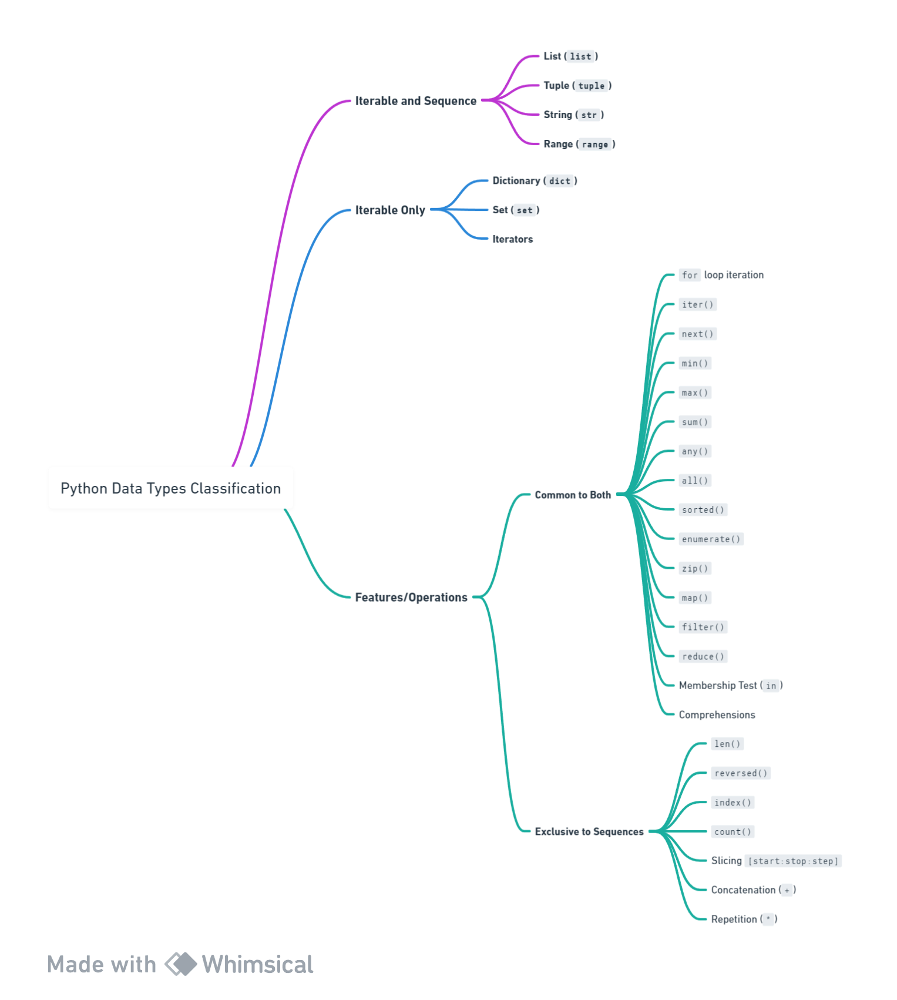

# Day 4 Notes
## Recap
- Tuples are immutable | lists are mutable
- We use .update() to add a set to an existing.
- We use .discard to remove an element from a set because .remove() provides an error when delete a nonexistent element.
- Set operations: 
    - intersection
    - union
    - symmetric differences
- Pass by reference: Updates the original library
- Pass by value: Creates a copy and updates that copy (slicing, unpacking, .copy())
- A map calls the function provided using each element in the list.
- lambda x: (lambda y: x*y)
    - We return whatever is on the right hand side.
- Lambda vs filter: Filter expects a boolean on the function it has, if it true you get a result.
- Maps:
    - Always returns the same number of elements as input
    - 

# Day 4:
- All sequences are iterable, but not iterables are sequences.
- Iterables and Sequences: I can do len on these
    - List
    - Tuple
    - String
    - Range
- Iterables only:
    - Dictionary
    - Set
    - Iterators

 

 - max(list, key): Key helps by providing which element it should compare in order to get the max value
 - filter does not change the data type
 - when doing imports have: we have 
 ```python
 if __name__ == "__main__":
    any code we don't want included when we calll this fiile
```
- Whenever you run the same file it is "__main__"

## Formatting
- "__main__" -> dunder variable
- use dir(x): To get the dunder methods 

# Test Review
- remove() - removes first occurance of a specific element in the list.
- continue in a loop skips the current iteration and continues with the next one.
- Reverse in a list: list.reverse()
    - .sort(reverse=True) -> This one sorts in descending order not reverse
- .pop() to remove an item in a list using index
- capture remaining items when unpacking a sequence
- In sets order does not matter.